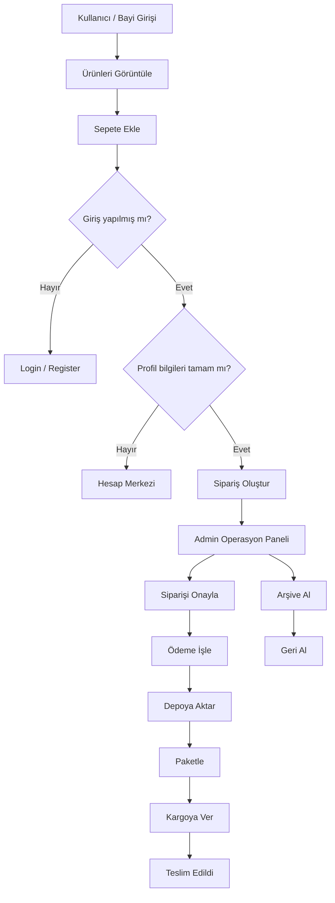

# ETicaretDepo

React + Firebase tabanlı, bayi mantığıyla çalışan bir e-ticaret depo ve operasyon yönetim uygulaması.

Bu proje klasik bir vitrin sitesinden daha fazlasını hedefler:

- son kullanıcı veya bayi hesabıyla giriş
- bayi fiyatı ve perakende fiyatı ayrımı
- admin panelinden ürün, stok ve operasyon yönetimi
- siparişlerin onay, ödeme, depo, kargo ve teslim akışıyla yönetilmesi
- ürün galerisi, açıklama, alt kategori ve yüksek stoklu katalog yapısı

## Proje Amacı

Bu uygulama, gerçek hayatta distribütör, toptancı veya merkez depo üzerinden çalışan bir bayi sistemini simüle eder.

Örnek kullanım senaryoları:

- merkez depo ürünleri admin tarafından yönetir
- bayi kullanıcıları sisteme girip ürünleri görür, sepete ekler ve sipariş oluşturur
- siparişler doğrudan tamamlanmaz; operasyon sürecine düşer
- admin siparişi onaylar, ödeme durumunu işler, depoya aktarır, paketler ve kargoya verir

## Öne Çıkan Özellikler

- Trendyol benzeri turuncu temalı admin panel
- çoklu görselli ürün kartları
- kategori + alt kategori yapısı
- ürün açıklama alanı
- bayi / perakende kanal ayrımı
- demo admin hesabı
- bayi kullanıcı profili
- profil bilgileri ile formsuz sipariş oluşturma
- sipariş operasyonunda arşive alma ve geri alma
- Firebase başarısız olduğunda `localStorage` ile yedek çalışma mantığı

## Demo Hesaplar

### Admin

- E-posta: `admin@eticaretdepo.com`
- Şifre: `admin1234`

### Bayi

- `/register` ekranından yeni bayi hesabı oluşturabilirsiniz
- bayi hesapları varsayılan olarak `dealer` rolüyle açılır

## Ekranlar

### Mağaza Tarafı

- ana sayfa
- kategori filtreleme
- ürün detay sayfası
- galeri görselleri
- sepet
- hesap merkezi
- profil düzenleme
- sipariş geçmişi

### Admin Tarafı

- dashboard
- ürün yönetimi
- ürün ekleme / güncelleme / silme
- çoklu görsel yükleme
- sipariş operasyon yönetimi
- arşivlenen siparişleri geri alma

## Sipariş Akışı

Bu projede sipariş tek bir `status` alanıyla değil, operasyonel adımlarla yönetilir:

1. `Onay Bekliyor`
2. `Onaylandı`
3. `Ödeme Alındı`
4. `Depoya Aktar`
5. `Hazırlanıyor`
6. `Paketlendi`
7. `Kargoya Verildi`
8. `Teslim Edildi`

Yanlış işlem yapılırsa sipariş tamamen silinmez:

- operasyondan kaldırılır
- arşive alınır
- admin isterse geri alır

## Sistem Akışı



## Ürün Modeli

Her ürün aşağıdaki yapıyı destekler:

```js
{
  id: "1",
  sku: "SKU-1001",
  name: "Ürün adı",
  brand: "Marka",
  category: "Ana kategori",
  subcategory: "Alt kategori",
  price: 1000,
  wholesalePrice: 850,
  stock: 120,
  reserved: 10,
  threshold: 20,
  location: "A-01",
  supplier: "Distribütör",
  minOrderQty: 4,
  channel: "B2B + Pazaryeri",
  description: "Ürün açıklaması",
  image: "Ana görsel",
  images: ["Ana görsel", "Galeri 1", "Galeri 2"]
}
```

## Kullanılan Teknolojiler

- React 19
- Vite
- React Router DOM
- Zustand
- Firebase Auth
- Firebase Firestore
- Lucide React

## Proje Yapısı

```text
src/
  pages/
    admin/
      AdminLayout.jsx
      Dashboard.jsx
      ProductManagement.jsx
      OrderManagement.jsx
    auth/
      Login.jsx
      Register.jsx
    shop/
      ShopLayout.jsx
      HomePage.jsx
      ProductDetail.jsx
      Cart.jsx
      Checkout.jsx
      AccountPage.jsx
  services/
    accountService.js
    authService.js
    productService.js
    orderService.js
    mockData.js
  store/
    useAuthStore.js
    useCartStore.js
```

## Yerelde Çalıştırma

```bash
npm install
npm run dev
```

Uygulama geliştirme modunda `127.0.0.1` üzerinden açılır.

## Production Build

```bash
npm run build
```

Build çıktısı `dist/` klasörüne yazılır.

## Preview

```bash
npm run preview
```

## Firebase Yapısı

Proje şu anda Firebase ile çalışacak şekilde ayarlıdır:

- `src/firebase.js` içinde Firebase config bulunur
- ürün ve sipariş verileri Firestore üzerinden okunur / yazılır
- giriş işlemleri Firebase Auth ile denenir
- eğer Firebase tarafında yazma veya auth problemi olursa bazı akışlarda yerel yedek mekanizma devreye girer

### Önemli Not

Şu an admin ürün yüklemede görseller `Firebase Storage` yerine tarayıcıda `base64` olarak saklanır.

Bu ne sağlar:

- hızlı demo
- upload benzeri deneyim
- ek backend kurmadan galeri desteği

Bu ne sağlamaz:

- gerçek dosya depolama
- CDN optimizasyonu
- büyük görseller için uzun vadeli ölçeklenebilirlik

Gerçek production için bir sonraki mantıklı adım:

- Firebase Storage entegrasyonu
- görsel URL’lerini Firestore’da saklama

## Demo ve Yedek Çalışma Mantığı

Projede iki katmanlı veri mantığı vardır:

### 1. Firebase

Mümkünse veriler önce Firebase’e yazılır.

### 2. Local Fallback

Eğer Firebase yazma veya okuma sırasında hata oluşursa:

- ürünler `localStorage` içinde saklanır
- siparişler `localStorage` içinde saklanır
- hesaplar `localStorage` içinde tutulur

Bu sayede demo veya geliştirme sırasında uygulama tamamen durmaz.

## Hesap Merkezi Mantığı

Sipariş oluşturmak için:

- giriş yapmak zorunludur
- profil bilgileri eksiksiz olmalıdır
- kullanıcı checkout ekranında ekstra form doldurmaz

Gerekli profil alanları:

- ad soyad
- şirket / bayi adı
- telefon
- şehir
- açık adres

Eksik bilgi varsa kullanıcı `AccountPage` ekranına yönlendirilir.

## Ürün Görsel Sistemi

Her ürün:

- 1 ana görsel
- birden fazla galeri görseli

ile çalışır.

Admin panelinde:

- birden fazla dosya seçilebilir
- mevcut galeriye ekleme yapılabilir
- önizleme gösterilir
- görsel kaldırılabilir

Ürün detay sayfasında:

- büyük ana görsel
- küçük galeri küçük resimleri
- aktif görsel değiştirme

desteği vardır.

## Gerçekçi Katalog Yapısı

Demo veriler sadece tek tip elektronik ürünlerden oluşmaz. Daha çok bayi ve toptan satış mantığına yakın olacak şekilde şu alanlara yayılmıştır:

- elektronik
- moda
- temizlik
- anne bebek
- gıda
- ofis
- telefon aksesuar
- küçük ev aletleri

Bu sayede hem perakende hem bayi sipariş mantığı daha doğal görünür.

## Geliştirme Notları

Şu anda yapılabilecek iyi sonraki adımlar:

- Firebase Storage entegrasyonu
- gerçek rol tablosu için Firestore `users` koleksiyonu
- ürün arama ve filtreleme
- bayi bazlı fiyat listesi
- sipariş detay sayfası
- dashboard grafikler
- code splitting ile bundle küçültme

## GitHub / Deploy Notları

Firebase Hosting için temel akış:

1. Firebase projesi oluştur
2. `.firebaserc` içindeki proje ID’yi kontrol et
3. GitHub Actions secret olarak servis hesabını ekle
4. `main` branch push sonrası deploy al

## Lisans

Bu repo şu anda özel / demo amaçlı geliştirme yapısı olarak düşünülmüştür. İstersen bu bölüme MIT veya özel lisans ekleyebilirim.
